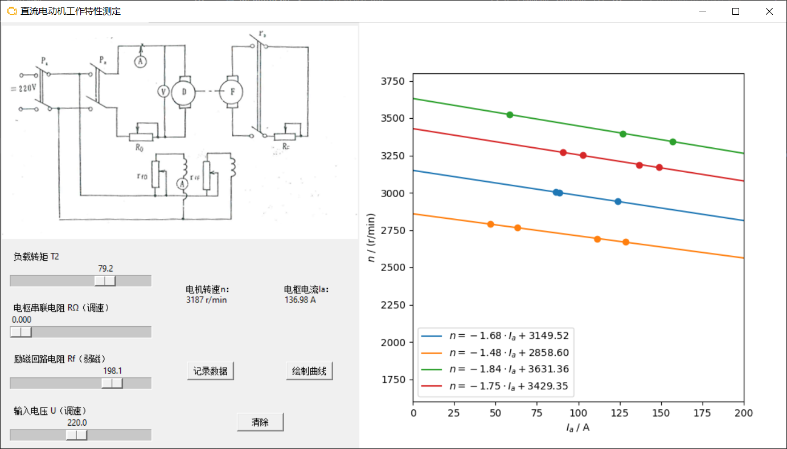

# Motor GUI
Measurement experiment of the operating characteristic curves of a separately excited DC motor with human-computer interaction interface, developed and modified based on [zz-f-g/MotorGUI](https://github.com/zz-f-g/MotorGUI).

并励直流电动机工作特性测定实验，使用人机交互界面完成。

## 依赖环境
- Python $\ge$ 3.9
- Numpy $\ge$ 1.21.5
- Matplotlib $\ge$ 3.5.2
- PyYAML
- tkinter

## 文件说明
```shell
.
├── dc-motor.py # 程序源码
├── images
│   ├── motor.ico # UI 图标
│   └── schematic.png # 电机电路图
├── motor-config.yaml # 电机模型参数配置文件
└── README.md # 项目说明
```

## 操作说明
初始界面


记录数据


最小二乘法，使用`np.linalg.lstsq`


多组数据描点


改变电枢串联电阻 $R_{\Omega}$


改变励磁回路电阻 $R_{\text{f}}$



改变输入电压 $U$


## 参数说明
电机YAML配置文件如下：


- PN - 额定功率 $P_N$
- UN - 额定工作电压 $U_N$
- nN - 额定转速 $n_N$
- IN - 额定电流 $I_N$
- Ra - 电枢回路总电阻 $R_{\text{a}}$
- Rf - 励磁回路总电阻 $R_{\text{f}}$
- error_sigma - 加性高斯白噪声标准差 $\sigma$